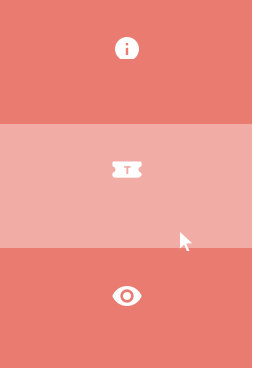
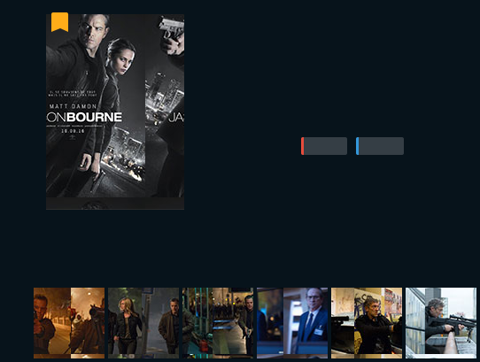

МИНИСТЕРСТВО НАУКИ И ВЫСШЕГО ОБРАЗОВАНИЯ

РОССИЙСКОЙ ФЕДЕРАЦИИ

ФЕДЕРАЛЬНОЕ ГОСУДАРСТВЕННОЕ БЮДЖЕТНОЕ ОБРАЗОВАТЕЛЬНОЕ УЧРЕЖДЕНИЕ ВЫСШЕГО ОБРАЗОВАНИЯ

«ВЯТСКИЙ ГОСУДАРСТВЕННЫЙ УНИВЕРСИТЕТ»

Институт математики и информационных систем

Факультет автоматики и вычислительной техники

Кафедра систем автоматизации управления

Дата сдачи на проверку:

«___» __________ 2021 г.

Проверено:

«___» __________ 2021 г.

Стилизация и трансформация элементов через CSS

Отчет по лабораторной работе № 3

по дисциплине

«Основы frontend-разработки и организации человеко-машинного интерфейса»

Разработал студент гр. ИТб-1301-01-00 ________________ /Буторин Д.М./

Проверил ст. преподаватель _________________ /Земцов М.А./

Работа защищена с оценкой	«___________» «___» __________ 2021 г.

Киров 2021

Цель лабораторной работы: Стилизация и трансформация элементов через CSS. CSS процессоры.

Задачи:
1. Организовать процесс работы над лабораторной работой
2. Изучить материал по основам стилизации элементов
3. Выполнить верстку макета по заданию преподавателя
4. Составить отчет по выполненным задачам
5. Защитить лабораторную работу

Ход выполнения:

1. Организовать процесс работы над лабораторной работой

В ходе организации рабочего пространства в репозитории “Basic frontend dev labs” создана ветвь “lab3” от стартового коммита главной ветви.

2. Изучить материал по основам стилизации элементов

Перед выполнением работы был изучен материал по основам работы c оформлением веб-документа [1, приложение Б]. 

3. Выполнить верстку макета по заданию преподавателя

Задание: *Сделать верстку веб-страницы [2, приложение Б]*

Макет веб-страницы представлен на рисунке 1.

Рисунок 1 - Макет веб-страницы

Выполненное задание представлено на рисунке 2. Листинг html страницы представлен в приложении А. Валидация HTML страницы успешно пройдена.

Рисунок 2 - Выполненная верстка

4. Составить отчет по выполненным задачам

Вывод: в ходе работы была изучена документация по cтилизации и трансформации элементов через CSS. Полный список изученной документации приведен в приложении Б. Получен опыт в применении CSS-стилей.

Приложение А

(обязательное) 

Листинг html-страницы

    <!DOCTYPE html>
    <html lang="en">
    <head>
        <meta charset="UTF-8">
        <meta http-equiv="X-UA-Compatible" content="IE=edge">
        <meta name="viewport" content="width=device-width, initial-scale=1.0">
        <link rel="stylesheet" href="header.css">
        <link rel="stylesheet" href="unit1.css">
        <link rel="stylesheet" href="unit2.css">
        <link rel="stylesheet" href="unit3.css">
        <link rel="stylesheet" href="unit4.css">
        <link rel="stylesheet" href="footer.css">
    </head>
    <body>
        

            <header class="header">
                
                
                
                
8

                
            </header>
            

                

                <ul class = "posters">
                    <li></li>
                    <li></li>
                    <li></li>
                    <li></li>
                    <li></li>
                </ul>
                

                    
                    
                

            
  
            

                
                
                
            

            

                
                 
                
                
            

            

                
                
                
                
            

            <footer class="footer">
                
                
                
                
            </footer>
        

    </body>
    </html>
        

Приложение Б

(справочное)

Библиографический список

1. Основы CSS [Электронный ресурс] / Елена Назарова, 2014-2021 HTML5BOOK.RU // Опубликовано: 2 января 2015 Обновлено: 22 декабря 2020. URL:<https://html5book.ru/osnovy-css/>.(Дата обращения: 21.03.2021).
2. IMDb concept [Электронный ресурс] / Figma. URL:<https://www.figma.com/file/j4dslZZvb5b9JLSEYQYKMo/imdb_concept?node-id=0%3A4>.(Дата обращения: 25.03.2021).
3.  Руководство по оформлению Markdown файлов [Электронный ресурс] / Artem Zhekov 2015// 2021 GitHub, Inc. URL:<https://gist.github.com/Jekins/2bf2d0638163f1294637>.(Дата обращения: 25.03.2021).
4. Общие требования к оформлению текстовых документов [Электронный ресурс] / секция курсового и дипломного проектирования методического совета Вятского государственного университета Киров 2004//СТП ВятГУ 101-2004. URL:<https://www.vyatsu.ru/uploads/file/1604/101_2004.pdf>.(Дата обращения: 25.03.2021).