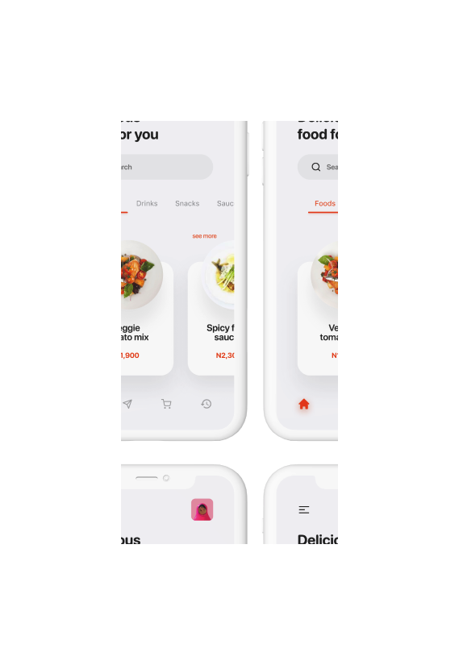

МИНИСТЕРСТВО НАУКИ И ВЫСШЕГО ОБРАЗОВАНИЯ

РОССИЙСКОЙ ФЕДЕРАЦИИ

ФЕДЕРАЛЬНОЕ ГОСУДАРСТВЕННОЕ БЮДЖЕТНОЕ ОБРАЗОВАТЕЛЬНОЕ УЧРЕЖДЕНИЕ ВЫСШЕГО ОБРАЗОВАНИЯ

«ВЯТСКИЙ ГОСУДАРСТВЕННЫЙ УНИВЕРСИТЕТ»

Институт математики и информационных систем

Факультет автоматики и вычислительной техники

Кафедра систем автоматизации управления

Дата сдачи на проверку:

«___» __________ 2021 г.

Проверено:

«___» __________ 2021 г.

Изучение основ языка JavaScript

Отчет по лабораторной работе № 4

по дисциплине

«Основы frontend-разработки и организации человеко-машинного интерфейса»

Вариант 3

Разработал студент гр. ИТб-1301-01-00 ________________ /Буторин Д.М./

Проверил ст. преподаватель _________________ /Земцов М.А./

Работа защищена с оценкой	«___________» «___» __________ 2021 г.

Киров 2021

Цель лабораторной работы: изучить основы языка JavaScript.

Задачи:

1. Изучить основные элементы и подходы к программированию в JavaScript
2. Выполнить верстку макета по заданию преподавателя
3. Составить отчет по выполненным задачам
4. Защитить лабораторную работу

Ход выполнения:

1. Изучить основные элементы и подходы к программированию в JavaScript

Перед выполнением лаборной работы была изучена документация по ООЯП - JavaScript. [1, приложение Б]

Особое внимание было уделено разделам:

* Введение в язык программирования;
* Основания для стандартизации;
* Структуры кода;
* Переменные;
* Базовые операторы;
* Операторы сравнения;
* Конструкции ветвления;
* Функции;
* Объекты;
* Работы с объектами;
* Тип данных Symbol;

При проведении аналогии с языком C# было выявлено большое сходство.

2. Изучить подходы к работе JavaScript в браузере

В ходе работы были изучены такие понятия как DOM-дерево, события и их типы, формы.

Документация по перечисленным подходам к работе представлена в приложении Б [1] в соответствующих разделах.

3. Выполнить верстку макета по заданию преподавателя

Для работы над лабораторной работой и сохранения всех результатов, в репозитории “Basic frontend dev labs” создана ветвь “lab4” от стартового коммита главной ветви.

При вычислении варианта задания был получен 3 варинт работы. Макет для 3 варианта представлен ниже на рисунке 1.

Рисунок 1 - Макет landing page

Так как данный макет необходимо реализовать с применением библиотеки tailwind [2, приложение Б], был установлен помощник редактора кода [3, приложение Б].

Выполненная верстка представлена на рисунке 2.

Рисунок 2 - Верстка страницы

HTML-страница провалидирована и представлена ниже в листинге А.

*Задание:* К полученной странице необходимо добавить на все кнопки интерактивное сообщение 
Я это сделал, а @UserName тебе от меня совет: “ Поступай правильно — поступай в ВятГУ!”.
Вывод сообщения должен производится для вариантов 1 и 5 в виде promt, 2-3 в виде модального окна, а 4 и 6 - в форме всплывающего уведомления. Ввод @UserName обязателен при первом выводе окна. Последующие выводы сообщений не должны требовать ввода @UserName.

Выполненное задание представлено ниже на рисунках 3 и 4.

Рисунок 3 - Уведомление с вводом

Рисунок 4 - Уведомление без вывода

Пошаговая инструкция создания проекта:

1. Реализация HTML разметки.
2. Подключение CSS стилей.
3. Добавление JavaScript событий для кнопок.
4. Составить отчет по выполненным задачам

При составлении отчета были закреплены навыки по markdown разметке [4, приложение Б] и общие требования к оформлению текстовых документов [5, приложение Б].

Вывод: в ходе работы были закреплены навыки cтилизации элементов через CSS. Приобретены знания по работе с tailwind. Также была изучена теоритическая информация об ООЯП - JavaScript, которая была закреплена на практике. Полный список изученной документации приведен в приложении Б.

Приложение А

(обязательное) 

Листинг страницы 

    <!DOCTYPE html>
    <html lang="en">
        <head>
            <meta charset="UTF-8" />
            <meta http-equiv="X-UA-Compatible" content="IE=edge" />
            <meta name="viewport" content="width=device-width, initial-scale=1.0" />
            <title>Lab4</title>
            
            
            <link href="https://unpkg.com/tailwindcss@^1.0/dist/tailwind.min.css" rel="stylesheet" />
            
        </head>
        <body>
            <header class="flex mx-auto container  justify-between">
                
                

				    <button id="nav-toggle" class="flex items-center px-3 py-2 border rounded text-gray-500 border-gray-600 hover:text-gray-900 hover:border-green-500 appearance-none">
					  <svg class="fill-current h-3 w-3" >
						  <title>Menu</title>
						  <path d="M0 3h20v2H0V3zm0 6h20v2H0V9zm0 6h20v2H0v-2z" />
					  </svg>
				  </button>
                

        
        

          <ul class="lg:flex  items-center ">
            <li class="mr-3">
            
Home
 
            </li>
            <li class="mr-3">
              
Product

            </li>
            <li class="mr-3">
              
Faq

            </li>
            <li class="mr-3">
              
Contact

            </li>
          </ul>
        

    </header>
    <main>
   
        

          <section class="px-16">
            
Food app
  
            
Why stay hungry when you can order form Bella Onojie

            
Download the bella onoje's food app now on

            <section class="text-center px-3 lg:px-0">
              <button class=" mt-4 mb-16 bg-red-300  text-white rounded-full py-3 px-20" onclick="buton()"> Playstore</button>
              <button class=" mt-4 border-2 border-red-300 lg:border-white lg:text-white text-red-300 rounded-full py-3 px-20" onclick="buton()"> App store</button>
            </section>
          </section>
        

        <section class=" md:mr-12">
            
            

        </section>
          
How the app works

 
        

          

            <section class="col-span-5"> 
              
            </section>
            

              
Create an account

              
Create/login to an existing account to get started

              
An account is created with your email and a desired password

              

              <section class="col-span-5"> 
                
              </section>
          

        

        

            

              

                
Explore varieties

                
Sop for your favorites meals as e dey hot.

                
Shop for your favorite meals or drinks and enjoy while doing it.
    
              

              
              <section class="col-span-5 self-center"> 
                
              </section>
            

          

     
        

          

            <section class="col-span-5"> 
              
            </section>
            

              
Checkout

              
When you done check out and get it delivered.

              
When you done check out and get it delivered with esase.

              

              <section class="col-span-5"> 
                
              </section>
          

        

          

            <section class="mx-auto container">
              
Download the app now on

              
Available on your favorite store. Start your premium experience now

           </section>
           

            <button class="mt-8  bg-red-300  text-white rounded-lg py-3 px-8 " onclick="buton()"> Playstore</button>
            <button class="mt-8  mb-8 text-white rounded-lg py-3 px-16 border-2" onclick="buton()"> App store</button>
          

          

    
    </main>
    <footer class = "m-4" >
        <section class="flex mx-auto container justify-between ">
            
            
            
Copyright 2020 Bella Onojie.com
 
        </section>
        
Copyright 2020 Bella Onojie.com

    </footer>
    </body>
    </html>

    

Приложение Б

(справочное)

Библиографический список

1. Современный учебник JavaScript [Электронный ресурс] / © 2007—2021  Илья Кантор // Обновлено 14.03.2021. URL:<https://learn.javascript.ru/>.(Дата обращения: 26.03.2021).
2. Tailwind CSS [Электронный ресурс] / Simon Vrachliotis //Обновлено 18.11.2020. URL:<https://tailwindcss.com/>.(Дата обращения: 07.04.2021).
3. Tailwind CSS IntelliSense [Электронный ресурс] / © 2021 Microsoft // Released on 21.08.2018 Last updated 08.02.2021. URL:<https://marketplace.visualstudio.com/items?itemName=bradlc.vscode-tailwindcss>.(Дата обращения: 07.04.2021).
4. Руководство по оформлению Markdown файлов [Электронный ресурс] / Artem Zhekov 2015// 2021 GitHub, Inc. URL:<https://gist.github.com/Jekins/2bf2d0638163f1294637>.(Дата обращения: 09.04.2021).
5. Общие требования к оформлению текстовых документов [Электронный ресурс] / секция курсового и дипломного проектирования методического совета Вятского государственного университета Киров 2004//СТП ВятГУ 101-2004. URL:<https://www.vyatsu.ru/uploads/file/1604/101_2004.pdf>.(Дата обращения: 09.04.2021).